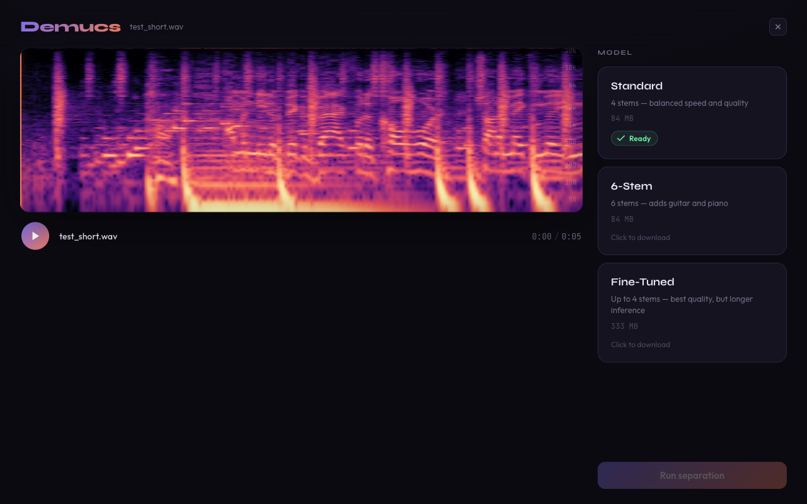
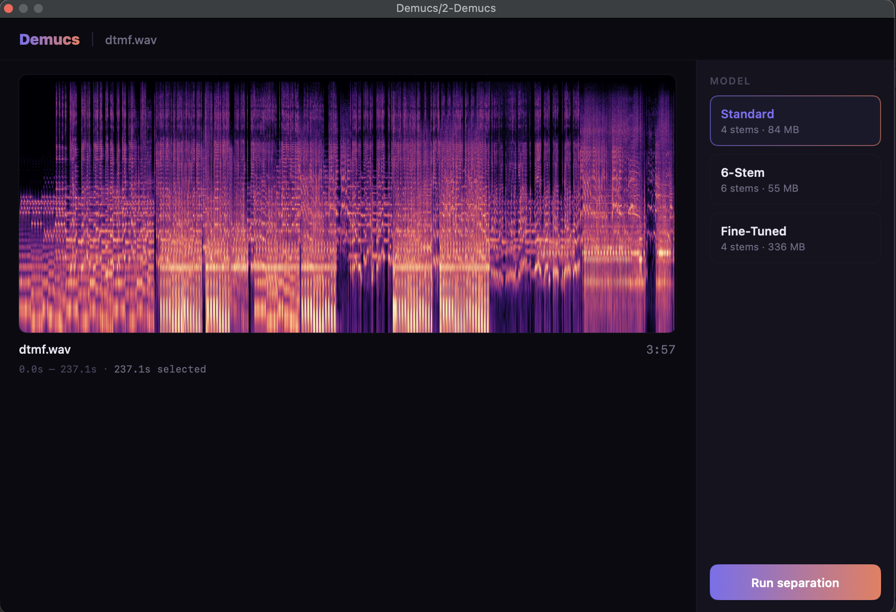
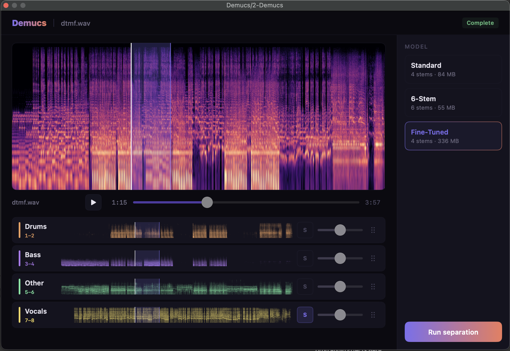
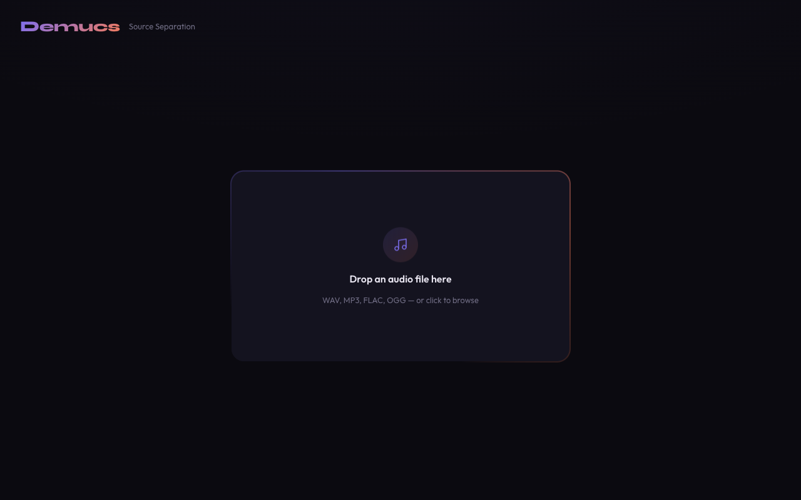
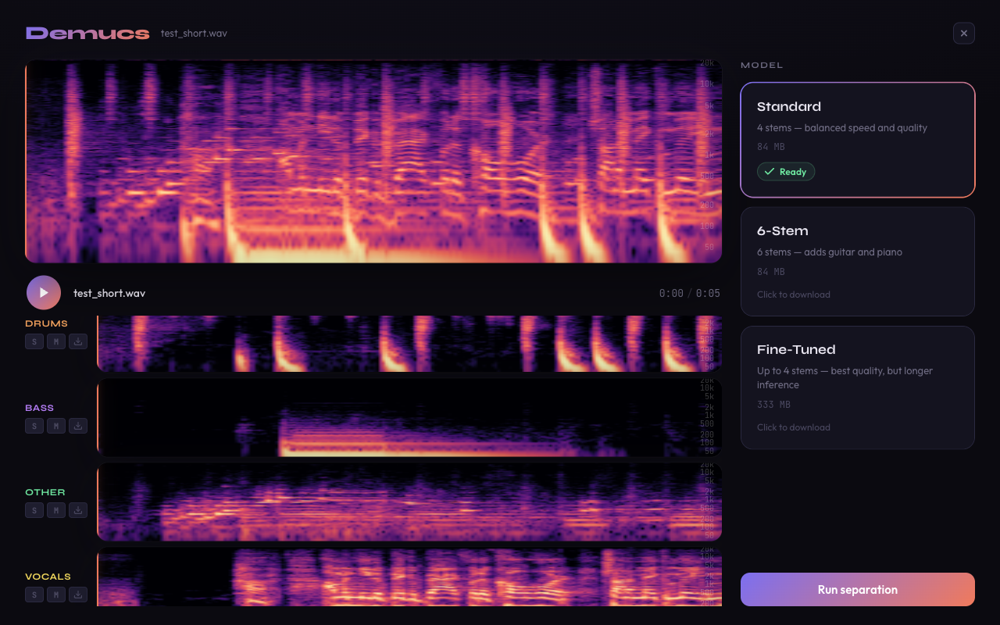

# demucs-rs

[](https://github.com/nikhilunni/demucs-rs/actions/workflows/ci.yml)
[](https://github.com/nikhilunni/demucs-rs/actions/workflows/release.yml)
[](LICENSE)

**[Try it in your browser](https://nikhilunni.github.io/demucs-rs/)**

A native Rust implementation of [HTDemucs v4](https://arxiv.org/abs/2211.08553) — state-of-the-art music source separation. Splits any song into individual stems (drums, bass, vocals, etc.) using GPU-accelerated inference via [Burn](https://burn.dev).

Runs as a **native CLI** (Metal on macOS, Vulkan on Linux/Windows), entirely **in the browser** via WebAssembly + WebGPU, or as a **DAW plugin** (VST3/CLAP, macOS) — no server, no uploads, fully local.



## Features

- **Three model variants** — Standard (4-stem), 6-Stem (adds guitar & piano), and Fine-Tuned (best quality)
- **GPU accelerated** — Metal, Vulkan, and WebGPU backends via Burn's wgpu support
- **DAW plugin** — VST3/CLAP instrument plugin with native macOS UI, MIDI-gated stem playback, and per-stem aux outputs
- **Browser app** — drag-and-drop web UI running 100% locally in your browser through WebAssembly
- **Native CLI** — fast command-line inference with progress tracking
- **Spectrogram visualization** — magma-colormap spectrograms with frequency axis labels
- **Multi-track playback** — solo, mute, and download individual stems in the web UI

## DAW Plugin

The plugin runs as a VST3 or CLAP instrument in any DAW on macOS. Drop in an audio file, run separation, and play back individual stems — driven entirely by MIDI input.

> **Note:** The plugin is currently macOS-only (native SwiftUI UI with Metal GPU inference).

**Drop an audio file, pick a model, and run separation:**



**Per-stem mixer with spectrograms:**



### How it works

1. **Load audio** — drag a file from your DAW or Finder into the plugin (WAV, AIFF, MP3, FLAC)
2. **Choose a model** and click **Run separation** — model weights are downloaded automatically on first use and cached for future runs
3. **Play stems via MIDI** — any MIDI note triggers playback, releasing all notes stops it. Playback always starts from beat 0 in the DAW
4. **Preview in the UI** — use the built-in transport to audition stems without MIDI

### Mixer & routing

- **Main output** is a stereo mix with per-stem gain sliders and solo buttons
- **Solo** isolates a stem in the main mix — hold Cmd and click to solo multiple stems
- **Aux outputs** provide the raw separated stems on dedicated stereo buses (Drums, Bass, Other, Vocals, Guitar, Piano), so you can route each stem to its own mixer channel in your DAW

### Installation

Download `Demucs.vst3` or `Demucs.clap` from the [latest release](https://github.com/nikhilunni/demucs-rs/releases) and copy to:

- **VST3:** `~/Library/Audio/Plug-Ins/VST3/`
- **CLAP:** `~/Library/Audio/Plug-Ins/CLAP/`

Since the plugin is not code-signed, macOS will quarantine it on first launch. Remove the quarantine flag:

```bash
xattr -cr ~/Library/Audio/Plug-Ins/VST3/Demucs.vst3
# or
xattr -cr ~/Library/Audio/Plug-Ins/CLAP/Demucs.clap
```

## Web App

The browser version compiles the full inference pipeline to WebAssembly and runs on your device using WebGPU. No audio is uploaded anywhere — everything stays local.

> **Note:** The WebAssembly build is significantly slower than the native CLI due to WebGPU overhead and WASM constraints. For batch processing or long tracks, the CLI is recommended.

**Drop an audio file:**



**Separation results with per-stem spectrograms:**



## Models

| Model | Stems | Size | Description |
|-------|-------|------|-------------|
| `htdemucs` | drums, bass, other, vocals | 84 MB | Balanced speed and quality |
| `htdemucs_6s` | drums, bass, other, vocals, guitar, piano | 84 MB | Adds guitar and piano separation |
| `htdemucs_ft` | drums, bass, other, vocals | 333 MB | Fine-tuned — best quality, slower |

Model weights are downloaded automatically from Hugging Face on first use (both CLI and web).

## CLI

```
Separate audio stems from a music file

Usage: demucs [OPTIONS] <INPUT>

Arguments:
  <INPUT>  Input audio file (WAV, AIFF, FLAC, MP3, OGG, M4A/AAC — stereo or mono, any sample rate)

Options:
  -m, --model <MODEL>    Model variant [default: htdemucs]
                         [possible values: htdemucs, htdemucs_6s, htdemucs_ft]
  -s, --stems <STEMS>    Stems to extract, comma-separated (e.g. "drums,vocals")
                         Available: drums, bass, other, vocals, guitar, piano
                         Default: all stems for the chosen model
  -o, --output <OUTPUT>  Output directory [default: ./stems/]
      --debug            Print layer-by-layer debug stats
  -h, --help             Print help
```

### Examples

```bash
# Separate all 4 stems
demucs song.mp3

# Extract only vocals
demucs song.mp3 -s vocals

# Use the 6-stem model, output to a custom directory
demucs song.flac -m htdemucs_6s -o ./my_stems/

# Best quality with the fine-tuned model
demucs song.wav -m htdemucs_ft
```

## Development Setup

### Prerequisites

- **Rust** (stable toolchain)
- **wasm-pack** — `cargo install wasm-pack`
- **Node.js** and **pnpm** — for the web frontend
- A GPU with Metal (macOS), Vulkan (Linux/Windows), or WebGPU (browser) support

### Building

```bash
# Build the native CLI (release mode, auto-detects GPU backend)
make cli

# Run the CLI directly
cargo run -p demucs-cli --release -- song.mp3
```

### Web App (local development)

```bash
# Dev server with debug WASM (fast compile, slower inference)
make dev

# Dev server with release WASM (slow compile, fast inference)
make dev-release

# Production build
make web
```

### All Make Targets

| Target | Description |
|--------|-------------|
| `make plugin` | Bundle VST3 + CLAP plugin (release) |
| `make cli` | Build native CLI (release) |
| `make wasm` | Build WASM (debug) |
| `make wasm-release` | Build WASM (release, optimized) |
| `make dev` | WASM debug + Vite dev server |
| `make dev-release` | WASM release + Vite dev server |
| `make web` | Full production web build |
| `make clean` | Remove all build artifacts |

### Running Tests

```bash
cargo test -p demucs-core
```

## Project Structure

```
demucs-rs/
├── demucs-core/     Core ML inference library (model, DSP, weights)
│                    Compiles to both native and wasm32-unknown-unknown
├── demucs-cli/      Native CLI binary (clap, symphonia, indicatif)
├── demucs-plugin/   DAW plugin — VST3/CLAP via nih-plug (macOS, SwiftUI editor)
├── demucs-wasm/     Thin wasm-bindgen adapter over demucs-core
├── web/             React + TypeScript frontend (Vite)
└── bench/           Python benchmark & validation suite
```

## Acknowledgments

- [Demucs](https://github.com/facebookresearch/demucs) by Meta Research — the original PyTorch implementation
- [demucs.cpp](https://github.com/sevagh/demucs.cpp) — C++ reference that informed tensor shapes and computation order
- [Burn](https://burn.dev) — the Rust deep learning framework powering inference

## License

Licensed under the [Apache License, Version 2.0](LICENSE).
